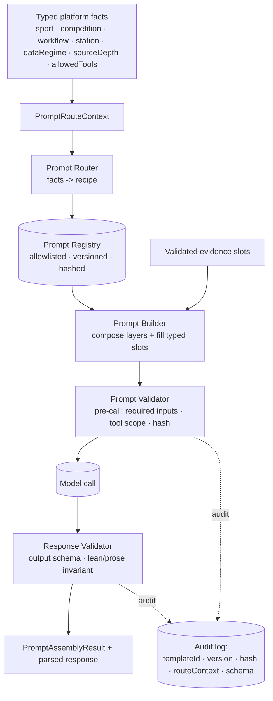
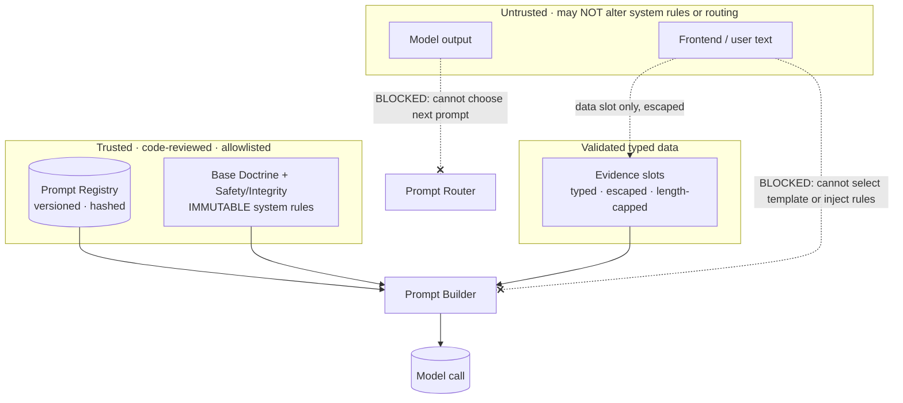
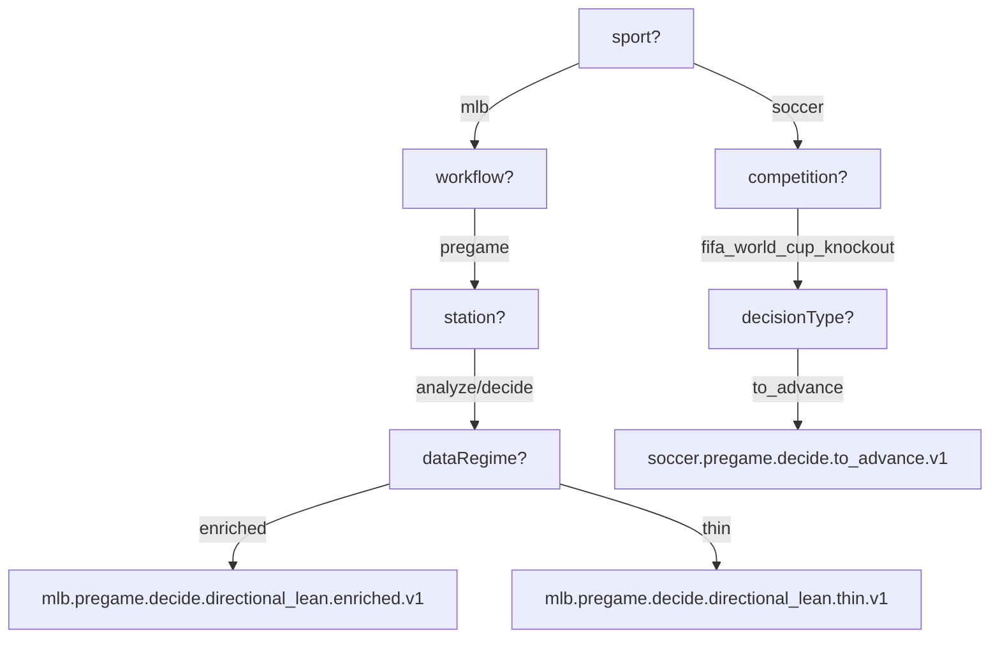
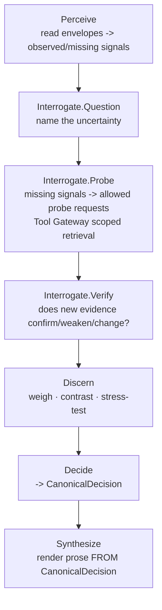

# Controlled Dynamic Prompt Assembly Architecture v1

**date:** 2026-06-28
**status:** ARCHITECTURE / DESIGN ONLY. No code, no production prompt change, no model call, no tuning, no cohort
work. Defines a target architecture and a phased path; implementation is a later, separately-authorized slice.
**type:** prompt-architecture design slice. dai-slice-runner + dai-skill-router gate + dai-grill-with-vault +
systematic-debugging + verification-before-completion + dai-token-tight.
**anchor:** Move DAI from static, sport-specific, evidence-filled f-string prompts toward **controlled dynamic
prompt assembly** -- routing to approved, versioned templates by typed workflow facts, then filling validated slots
from known data -- without ever allowing free-form prompt generation, frontend/model-driven prompt selection, or
environment drift.

See also: [[canonical-decision-composition-hardening-v1]], [[analyzer-generation-side-lean-agreement-hardening-v1]],
[[prompt-ledger-hook-v1]] (development-time ledger -- distinct from this runtime assembly system),
[[mismatch-remediation-v1]], the model-boundary trace in [[current-slice]] (2026-06-28).

---

## 1. Problem statement

Today every sports run builds its model prompt as a Python f-string: one of three sport-specific system prompts
(`_MLB_SYSTEM` / `_FOOTBALL_SYSTEM` / `_BASKETBALL_SYSTEM`, `sports_analyzer.py:216-281`) plus a shared output schema
(`_JSON_SHAPE`, `:80-145`), concatenated with evidence blocks assembled inline in `analyze_mlb` / `analyze_football`
/ `analyze_basketball`. Prompt selection is a hard-coded `if competition in {...}` dispatch (`routes/sports.py:31-60`).
There is **no prompt registry, router, template contract, versioning, hashing, or per-call audit of which prompt ran**.

As DAI adds competitions (soccer/World Cup), workflows (pregame vs near-close), and eventually executable protocol
stations (Perceive / Interrogate / Discern / Decide / Synthesize), this static model does not scale safely: prompt
logic accretes inside one file, prompt choices are implicit, and there is no auditable, versioned, allowlisted record
of exactly which approved prompt produced a given decision.

## 2. Why current prompt construction is insufficient

- **Not auditable.** No persisted record of which prompt text/version produced a run. A prompt edit silently changes
  behavior with no template id or hash on the run.
- **Not versioned/allowlisted.** Prompts are f-strings; "approval" is a code review of arbitrary string edits, not a
  registry of named, hashed, approved templates.
- **Selection is hard-coded, not data-routed.** Sport is chosen by an `if` ladder; data regime (thin vs enriched),
  workflow, station, and decision type do not route the prompt -- they are folded into one prompt's branches.
- **No station separation.** The single call emits all protocol stations at once (protocol-as-output). There is no
  per-station prompt contract to support future protocol-as-execution.
- **Evidence is concatenated inline.** Typed context is stringified into the prompt by bespoke code per sport; no
  typed slot contract, no escaping/again-st-injection discipline declared, no "raw provider payloads must not be
  dumped" guarantee enforced structurally.
- **No canonical-decision boundary in the prompt layer.** lean_side and prose are sibling outputs of one prompt; the
  prompt layer does not model a CanonicalDecision that the narrative must project from.

## 3. What "controlled dynamic prompt assembly" means

**Dynamic within constraints.** The system dynamically *selects and assembles* a prompt, but only from an
**approved, versioned, allowlisted registry**, routed by **typed workflow facts**, filled from **typed, validated
data slots**. It is NOT free-form generation:

- the **model never chooses its own privileged prompt**;
- the **frontend/user never injects privileged instructions**;
- **runtime data fills slots but cannot rewrite system rules**;
- assembly is **deterministic** for a given route context + input set.

Six separated responsibilities (each a distinct unit, small and testable):

| Component | Responsibility |
|---|---|
| **Prompt Registry** | Approved, versioned inventory of prompt templates/fragments (allowlist + hashes + schemas). |
| **Prompt Router** | Chooses the approved template recipe from a typed `PromptRouteContext` (facts only). |
| **Prompt Builder** | Fills approved templates with typed, validated slot values -> assembled prompt. |
| **Prompt Contract** | Per template: required typed inputs, output schema, allowed tools, station purpose. |
| **Prompt Validator** | Validates assembled-prompt metadata (pre-call) and model response shape/invariants (post-call). |
| **Protocol Runner** *(future)* | Executes station prompts in order, each via the Tool Gateway's scoped access. |

## 4. Non-goals (this slice and v1)

- No implementation of the assembly engine (this slice is docs-only).
- No change to any production prompt text, model, temperature, confidence, advertised strength, or buyer copy.
- No free-form / model-generated prompts; no LLM-chosen template selection.
- No DB-stored prompt bodies (see Q1 rationale); no environment-specific prompt overrides.
- No protocol-as-execution implementation (only preparation).
- No Google Drive, FIFA, cohort capture, or settlement work.

## 5. Current prompt boundary summary (evidence)

- One model call per run, Python only: `sports_analyzer.py:621` (`chat.completions.create`, gpt-4o-mini, temp 0.3,
  `response_format=json_object`). .NET makes zero model calls; it routes the analyze call through the Tool Gateway
  (`SportsAnalyzer.cs:53`, node `platform.analyze`) and gathers evidence via `SportsRetriever` (node
  `platform.retrieve`).
- Prompt pieces today: `_JSON_SHAPE` (shared output schema), `_MLB_SYSTEM` / `_FOOTBALL_SYSTEM` / `_BASKETBALL_SYSTEM`
  (sport system prompts), evidence blocks built inline in `analyze_*`. Dispatch by `if competition` (`routes/sports.py`).
- Protocol is representation: `CognitiveProtocolBuilder` reconstructs the protocol from one model output;
  `Interrogate.Probe` is .NET-deterministic; Synthesize is constants. `ProtocolNodeRunner` / Probe Refresh are dormant.

```mermaid
flowchart LR
  SRC[External sources<br/>StatsAPI · the-odds-api] --> RET[.NET SportsRetriever<br/>Tool Gateway: platform.retrieve]
  RET --> CTX[Typed context<br/>starters · market · envelopes]
  CTX --> AN[.NET SportsAnalyzer<br/>Tool Gateway: platform.analyze]
  AN --> PY[Python analyze_mlb]
  PY --> PB[f-string assembly<br/>_MLB_SYSTEM + _JSON_SHAPE + evidence]
  PB --> M[(One model call<br/>gpt-4o-mini)]
  M --> PR[_parse_response + _contain_lean_agreement]
  PR --> CMP[.NET SportsComposer + CognitiveProtocolBuilder]
  CMP --> DB[(AgentRun persistence)]
```



## 6. Proposed architecture

A layered, deterministic assembly: typed facts route to a recipe of approved template layers; the builder composes
them in fixed layer order and fills typed slots; validators gate before and after the model call. Layer order:

```
Base Doctrine Prompt        (immutable: identity, integrity rules, no-hype, no-fabrication)
  + Workflow Prompt         (sports_pregame_analysis | near_close | ...)
  + Station Prompt          (perceive | interrogate.question | interrogate.probe | ... | decide | synthesize)
  + Sport Overlay           (mlb | nba | nfl | soccer)
  + Competition Overlay     (mlb_regular_season | fifa_world_cup_knockout | ...)
  + Data-Regime Overlay     (market_backed_starter_enriched | thin | ...)
  + Decision-Type Overlay   (directional_lean | to_advance | draw_no_bet | ...)
  + Output Schema           (referenced by id; validated post-call)
  + Safety/Integrity Constraints  (immutable; appended last so nothing overrides them)
  + Typed Runtime Evidence Slots  (validated/escaped data only)
```



## 7. Prompt Registry

- **Location (Q1): code, file-based, code-reviewed -- NOT database, NOT vault.** Rationale: templates must be
  versioned in git, reviewed via PR, identical across environments (no env drift), and deterministic. The DB would
  allow silent, unreviewed, env-specific changes; the vault is knowledge/doctrine, not a runtime artifact. **The vault
  holds this doctrine; the dai repo holds the approved templates.** Hybrid only in the sense that the registry
  *manifest* (id -> file, version, hash, schema, contract) is code, and template *bodies* are versioned files.
- **Storage (Q3): versioned files**, one immutable file per `templateId@version` (e.g.
  `services/agent-service/app/prompts/mlb/pregame/decide/directional_lean/v1.txt`) + an in-code manifest. Not
  embedded f-strings (current), not DB rows. A new version = a new file + manifest entry, never an in-place edit.
- **Canonical in v1 (Q2):** the registry manifest + template files in code are canonical for *what the prompt is*;
  the typed `PromptRouteContext` (computed from .NET retrieval facts + run context) is canonical for *which* prompt.
- **Env-drift prevention (Q4):** template bodies are code (same artifact every env); no config/DB/feature-flag may
  override a template body; CI verifies each manifest entry's recorded hash equals the SHA-256 of its file; routing
  facts are typed and platform-computed, never environment config.

## 8. Prompt Router

Chooses the template recipe from a `PromptRouteContext` using **facts only**. Valid routing facts: sport, competition,
workflow, station, micro-action, decision type, source depth, data regime, evidence completeness, market availability,
identity confidence, buyer-readiness, allowed tools. **Invalid bases (rejected): the model wanting a different prompt;
the user/frontend asking for a "stronger" prompt; unsanitized natural language; hidden Angular business logic.** The
router is pure and deterministic: same context -> same recipe -> same `templateId@version`. Every selection emits an
**auditable reason** (which facts chose which template).

## 9. Prompt Builder

Composes the recipe's layers in fixed order and fills **typed runtime slots** with validated data. Rules: slot values
are typed and validated/escaped (length caps, character policy, no raw provider JSON dumps); slots may only appear in
data positions, never in system-rule positions; the immutable Safety/Integrity layer is appended last so no earlier
layer or slot can override it. Output: a fully-assembled prompt + the metadata needed for audit. Deterministic for a
given (recipe, slot values).

## 10. Prompt Contract

Per template, declared in the manifest:

- `requiredInputs`: typed slot names + types (e.g. `home_team: TeamRef`, `starter_block: StarterContext?`).
- `outputSchemaId`: the schema the model response must satisfy.
- `allowedTools`: tools/data this station may access (scoped by the Tool Gateway).
- `stationPurpose`: which protocol station + micro-action this template serves.
- `layer`, `version`, `hash`, `approvedReviewRef`.

A template cannot be assembled if its required inputs are absent/ill-typed (fail closed). A station can only request
tools in its `allowedTools`.

## 11. Prompt Validator

Two gates, both deterministic:

- **Pre-call:** required inputs present and typed; slot values validated/escaped; requested tools subset of
  `allowedTools`; template hash matches manifest; route context complete. Failure -> fail closed (no model call).
- **Post-call:** model response matches `outputSchemaId`; cross-field invariants hold -- notably the **lean/prose
  agreement invariant** (reusing today's `_contain_lean_agreement` / .NET `ArtifactDirectionConsistencyEvaluator`).
  This is where the recent hardening becomes a first-class, contract-driven validator rather than ad-hoc parsing.

## 12. Audit / logging requirements

Logged with **every model call** (Q8): `templateId`, `version`, `promptHash` (template) + `assembledHash` (post-fill),
`routeContext` (the facts), `outputSchemaId`, `allowedTools`, `tenantId`, `agentRunId` / `correlationId`, model id,
and the router's `assemblyReason`. Slot *values* may be logged with secrets redacted; raw provider payloads are never
logged into the prompt audit. This makes every decision traceable to an exact approved prompt version.

## 13. Security constraints (mapped to requirements)



1 allowlisted templates · 2 versioned · 3 prompt IDs logged · 4 hashes logged · 5 typed inputs · 6 slots
validated/escaped · 7 explicit output schemas · 8 tools scoped per station · 9 frontend cannot alter system prompts
(data-slot-only, escaped) · 10 model output cannot alter selection (router consumes facts only) · 11 selection has an
auditable reason · 12 registry changes are PR-reviewed · 13 no secrets/credentials in prompts · 14 no raw provider
payload dumps (typed slots only) · 15 deterministic assembly.

## 14. PromptRouteContext shape (minimal viable, Q5)

```jsonc
PromptRouteContext {
  tenantId: string,
  product: string,                 // "sports-v1"
  workflow: string,                // "sports_pregame_analysis"
  sport: string,                   // "mlb"
  competition: string,             // "mlb_regular_season"
  station: string,                 // "decide" (v1 may be a single "analyze" station)
  microAction: string | null,      // "question" | "probe" | "verify" | null
  decisionType: string,            // "directional_lean"
  dataRegime: string,              // "market_backed_starter_enriched" (derived from sourceDepth)
  sourceDepth: { [signal: string]: "enriched"|"rich"|"shallow"|"missing" },
  marketAvailable: boolean,
  identityConfidence: "confirmed"|"unmatched",
  buyerReadiness: "buyer_ready_validated"|"smoke_level_only"|...,
  allowedTools: string[]           // ["source_envelope_read","missing_signal_read"]
}
```

## 15. PromptTemplate shape (minimal viable, Q6)

```jsonc
PromptTemplate {
  templateId: string,              // "mlb.pregame.decide.directional_lean.market_backed_starter_enriched.v1"
  version: string,                 // "v1"
  hash: string,                    // sha256 of the canonical body file
  layer: "base"|"workflow"|"station"|"sport_overlay"|"competition_overlay"|"data_regime_overlay"|"decision_type_overlay"|"safety",
  stationPurpose: string,
  requiredInputs: { name: string, type: string, required: boolean }[],
  outputSchemaId: string,          // "sports_decision_artifact_v3"
  allowedTools: string[],
  body: string,                    // with named {{slots}}; system rules are static text
  approvedReviewRef: string        // PR/commit that approved this version
}
```

## 16. PromptAssemblyResult shape (minimal viable, Q7)

```jsonc
PromptAssemblyResult {
  templateId: string, version: string,
  templateHash: string,            // identity of the approved template (pre-fill)
  assembledHash: string,           // sha256 of the exact assembled prompt (post-fill) for the call audit
  assembledSystem: string, assembledUser: string,
  routeContext: PromptRouteContext,
  outputSchemaId: string,
  allowedTools: string[],
  slotValues: { [name: string]: <validated, redacted-where-secret> },
  assemblyReason: string,          // "sport=mlb workflow=pregame regime=enriched -> <templateId>"
  warnings: string[]
}
```

Prompt hashing (Q9): SHA-256. **Template hash** over the canonical pre-fill body (normalized newlines) = approval
identity. **Assembled hash** over the final filled prompt = exact runtime-call audit. Both logged. Output schemas
(Q10) are associated by `outputSchemaId` on the template and validated post-call by the Prompt Validator.

## 17. Routing decision examples



Overlays compose: sport overlay (mlb) supplies starter/bullpen reasoning + slot defs; data-regime overlay (enriched
vs thin) adjusts which evidence slots are required and how confidently the read is framed -- both chosen by **facts**
(`sourceDepth`), never by model/user preference.

## 18. MLB pregame example (concrete)

`PromptRouteContext`: `{workflow: sports_pregame_analysis, sport: mlb, competition: mlb_regular_season, station:
analyze, decisionType: directional_lean, dataRegime: market_backed_starter_enriched, sourceDepth: {startingPitching:
enriched, marketOdds: rich, bullpen: missing}, allowedTools: [source_envelope_read, missing_signal_read], outputSchema:
sports_decision_artifact_v3}` -> `templateId = mlb.pregame.analyze.directional_lean.market_backed_starter_enriched.v1`.
Builder fills slots `{home_team, away_team, game_date, starter_block, market_block}` (the same typed data `analyze_mlb`
uses today), appends the immutable safety layer + output schema, and the Validator enforces the lean/prose invariant
post-call. **In Phase 3 this must assemble a prompt equivalent to today's, with no behavior change.**

## 19. Future World Cup example (conceptual only)

`PromptRouteContext`: `{workflow: sports_pregame_analysis, sport: soccer, competition: fifa_world_cup_knockout,
station: decide, decisionType: to_advance, dataRegime: market_only, marketAvailable: true, allowedTools:
[source_envelope_read]}` -> `soccer.pregame.decide.to_advance.market_only.v1`, `outputSchema:
soccer_decision_to_advance_v1`. This shows the registry naturally absorbs new competitions/decision-types as new
allowlisted templates + overlays, with no change to base doctrine or the router's fact model. (Conceptual; FIFA work
remains paused.)

## 20. Protocol-as-execution preparation



Each station maps to a station Prompt Template with its own contract (required inputs, output schema, allowed tools,
purpose). The router/registry built here is exactly what a future `ProtocolRunner` needs: it will request station
templates in order, each assembled and validated identically, each tool-scoped via the Tool Gateway (already live for
`platform.retrieve` / `platform.analyze`; Probe would add a scoped retrieval node). Staged execution would reduce
lean/prose contradiction risk structurally (Decide resolves the canonical side; Synthesize projects prose from it, so
prose cannot be an independent decision) -- at the cost of N model calls, latency, and orchestration complexity. **Not
justified now; keep one-call generation with the stronger invariants this architecture enables.**

## 21. CanonicalDecision relationship

The registry makes the canonical-decision boundary first-class: the **Decide** station's `outputSchema` is
`canonical_decision_v1` (side + side_source + rationale + confidence); the **Synthesize** station *requires*
`CanonicalDecision` as an input slot and may not name a side it does not carry. Even in today's single-call model, the
Output Schema + post-call Validator encode the invariant that lean_side is canonical and prose is its projection
(today enforced by the lean-agreement hardening; here it becomes a declared template contract). This is the prompt-layer
home for the "NoLean Reason + Canonical Decision Marker" idea from the prior investigation.

## 22. Implementation phases (evaluated + refined)

| Phase | Slice | Scope | Notes / refinement |
|---|---|---|---|
| 1 | **Controlled Dynamic Prompt Assembly Architecture v1** | docs only (this slice) | done here |
| 2 | **Prompt Registry Contract v1** | define `PromptRouteContext`, `PromptTemplate`, `PromptAssemblyResult` + manifest schema; no live path | add CI hash-check of manifest vs files |
| 3 | **Prompt Assembly Engine v1** | assemble the current MLB prompt through the registry; **byte-equivalent (or proven-equivalent) to today**; no behavior change | gate on a golden-prompt equality test |
| 4 | **Prompt Audit Logging v1** | log templateId/version/hash/routeContext/outputSchema per call | persist on the AgentRun for calibration |
| 5 | **Interrogate Prompt Route v1** | add a route for `interrogate.question` only; non-live / shadow | contract + template, no live call |
| 6 | **Interrogate Runtime Shadow v1** | run Question/Probe/Verify in shadow; no buyer/persistence change | compare shadow vs single-call output |
| 7 | **Protocol-as-Execution Pilot v1** | execute a limited Interrogate path for MLB pregame; **no tuning until measured** | only after shadow evidence justifies it |

Refinements: Phase 3 must have an explicit **prompt-equivalence test** (assembled == current) as its completion gate;
Phase 4 should persist the audit fields on the AgentRun so calibration can segment by prompt version; Phases 5-6 stay
**shadow** (no buyer/persistence/settlement effect) until measured, consistent with the no-tuning-until-evidence
doctrine.

## 23. Risks

- **Overbuild.** A full registry/router/builder/validator for one sport is heavy. Mitigation: Phases 2-4 deliver the
  contract + a byte-equivalent MLB assembly + audit *before* any new behavior; stop if value is unclear.
- **Equivalence drift.** Migrating the f-string prompt into templates could subtly change the prompt (whitespace,
  ordering) and thus model behavior. Mitigation: Phase 3 golden-equivalence test; ship only on exact/proven equality.
- **Hidden coupling.** Evidence assembly currently lives in `analyze_*`; moving slots into templates must preserve the
  typed context exactly. Mitigation: typed slot contracts mirror the existing context objects.
- **Audit volume / PII.** Logging assembled prompts could leak data. Mitigation: log hashes + ids by default; redact
  slot values; never log raw provider payloads.
- **Premature staged execution.** Jumping to protocol-as-execution adds cost/latency without measured benefit.
  Mitigation: shadow-first (Phases 5-6).

## 24. Open questions

- Should the registry live in the Python service, the .NET platform, or a shared contract package? (Leaning: the
  **router/contract in .NET** where route facts are computed at retrieve time; **template bodies where the model call
  is** -- Python -- with a shared manifest contract. Resolve in Phase 2.)
- Should Phase 3 require *byte* equivalence or *semantic* equivalence to today's prompt? (Leaning byte-equivalent for
  safety.)
- Where do audit fields persist -- a new AgentRun column/table or the existing artifact? (Resolve in Phase 4.)
- How is `dataRegime` canonically derived from `sourceDepth`? (Needs a small typed mapping in Phase 2.)

## 25. Recommended next slice

**Phase 2 -- Prompt Registry Contract v1 (contracts only, no live path change):** define `PromptRouteContext`,
`PromptTemplate`, `PromptAssemblyResult`, the manifest schema, the `dataRegime`-from-`sourceDepth` mapping, and the
CI hash-check; with tests. No model/prompt/confidence change; no cohort work. Only after Phase 2 should Phase 3
(byte-equivalent MLB assembly) proceed.
