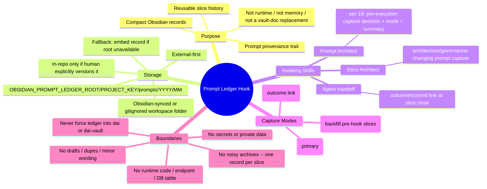

# Prompt Ledger Hook State Audit + Mind Map v1

**status:** active doctrine -- audit snapshot of [[prompt-ledger-hook-v1]] implementation state as of 2026-06-26.
**date:** 2026-06-26
**type:** process/skill architecture audit. Read-only over skills + vault + runtime. No runtime/app/Cognitive-Factory
change; no new behavior; no prompt-capture expansion. dai-slice-runner + dai-skill-router gate + dai-grill-with-vault
+ dai-docs-architect + dai-slice-prompt-architect + verification-before-completion + dai-agent-handoff.

This doc audits and maps the hook; it does NOT restate the doctrine. Canonical rules live in
[[prompt-ledger-hook-v1]] -- read that for purpose/format/criteria. Here: where it lives, who invokes it, when it
fires, and a verdict.

## objective

Verify the implementation state of Prompt Ledger Hook v1 and produce a simple mind-map explaining why it exists,
where it lives, which skills invoke it, and when it should trigger.

## current implementation state (one line)

**COMPLETE and process-layer-only.** The hook is a cross-cutting lifecycle hook implemented entirely in the
skill/doctrine layer, wired by composition into three skills, noted in the inventory, with zero DAI runtime coupling.

## files inspected

| file | role | result |
|---|---|---|
| `06 Execution/prompt-ledger-hook-v1.md` | canonical doctrine | present; all required elements (below) |
| `.claude/skills/dai-slice-prompt-architect/SKILL.md` (in `dai`) | invoker | sec 19 "Prompt Ledger Hook" present |
| `.claude/skills/dai-docs-architect/SKILL.md` (in `dai`) | invoker | "Pair with" hook bullet present |
| `.claude/skills/dai-agent-handoff/SKILL.md` (in `dai`) | invoker | "Pair with" hook bullet present |
| `06 Execution/skills/dai-skills-inventory-v1.md` | inventory | lines 186-188 note the hook + composition |
| `dai/platform`, `dai/apps`, `dai/services` | runtime isolation | 0 matches (grep cs/py/ts/json/csproj) |
| `06 Execution/handoffs/current-slice.md` | prior-slice trail | Prompt Ledger Hook v1 + the 2026-06-26 cohort record entry |

## verified hook points

| expected point | evidence | status |
|---|---|---|
| canonical doctrine defines purpose / storage / criteria / timing / format / privacy / retroactive / bloat | `prompt-ledger-hook-v1.md` sections purpose, A (storage), B (capture rules), capture timing, C (record format), privacy/security boundaries, retroactive capture, avoiding ledger bloat | PASS (8/8 elements) |
| prompt architect: capture? / mode? / lane-stage-pattern? / ignore drafts? / exclude secrets? | `dai-slice-prompt-architect` sec 19 (decide capture; set `capture_mode` pre/post/retroactive; emit lane+activation_stage+prompt_type+reusable-pattern summary; "do NOT capture drafts"; "never capture secrets/credentials/private data") | PASS |
| docs architect: capture on architecture/governance/milestone-pattern prompts | `dai-docs-architect` Pair-with: "when a docs/milestone prompt MATERIALLY changes canonical architecture, invoke the hook" | PASS |
| agent handoff: link outcome/commit/handoff to an existing record at slice close | `dai-agent-handoff` Pair-with: "at slice close, if a prompt-ledger record exists ... link the final outcome (handoff/commits) back to it (set its `# Outcome` / `related_commits`)" | PASS |
| skills inventory notes the hook | `dai-skills-inventory-v1.md:186-188` (composition into the three skills; no new skill; count stays 14) | PASS |
| application/runtime isolation -- no app code for capture/Obsidian-write/DB-table/endpoint/runtime-hook | grep `prompt.?ledger|OBSIDIAN_PROMPT_LEDGER|ledger.?root` across `dai/platform`+`dai/apps`+`dai/services` (cs/py/ts/json/csproj) = 0 matches; keyword lives only in the 3 skill files + vault docs | PASS (isolated) |

## lifecycle timing map (Part B)

When the hook can trigger across the slice lifecycle, and why each timing exists:

| # | stage | capture? | mode | why |
|---|---|---|---|---|
| 1 | prompt drafting | NO | -- | drafts are noise; capturing them creates ledger bloat and duplicate near-revisions |
| 2 | **prompt finalized** | **YES (primary)** | `pre-execution` | the finalized canonical prompt is the reusable artifact; capture before sending so provenance is recorded independent of outcome |
| 3 | slice execution | NO (unless the prompt materially changes) | -- | execution produces behavior/outcomes, not a new prompt; re-capture only if the prompt was materially rewritten mid-slice |
| 4 | slice close / handoff | YES (link) | `post-execution` | link the outcome (handoff + commits) back to the record so the prompt connects to what it produced |
| 5 | historical prompt discovered | YES (backfill) | `retroactive` | a slice whose prompt predates the hook is recovered once and marked retroactive; do not reconstruct from memory if the text is unavailable |

One canonical record per slice across all timings -- pre-execution creates it, post-execution links its outcome,
retroactive is only for pre-hook slices.

## mind-map (Part C)

Plain-English outline (for readers without Mermaid):

- **Why it exists** -- preserve finalized, reusable slice prompts as compact provenance records, so important prompts
  become reusable history without bloating repos or duplicating drafts. It is a provenance trail, not runtime code,
  not model memory, not a replacement for decision/doctrine vault docs.
- **Where it lives** -- doctrine in `06 Execution/prompt-ledger-hook-v1.md`; behavior composed into three skills;
  records stored external-first at `<OBSIDIAN_PROMPT_LEDGER_ROOT>/<PROJECT_KEY>/prompts/<YYYY>/<MM>/<DATE>-<SLICE>.md`.
- **Who invokes it** -- `dai-slice-prompt-architect` (decides capture on a finalized prompt, sets the mode, emits the
  record), `dai-docs-architect` (captures when a docs/milestone prompt materially changes architecture),
  `dai-agent-handoff` (links the outcome back at slice close). Composition, not inheritance: the hook owns the rules
  once; each skill calls it.
- **When it fires** -- finalized (pre-execution, primary); slice close (post-execution link); historical discovery
  (retroactive). Never on drafts or ordinary execution.
- **What it refuses** -- drafts, duplicates, minor wording, secrets/private data, runtime implementation, and noisy
  archives. One canonical record per slice; never forced into the git repos by default.

## application / runtime isolation result

**Fully isolated -- no runtime coupling.** A keyword scan (`prompt.?ledger`, `OBSIDIAN_PROMPT_LEDGER`, `ledger.?root`)
across `dai/platform`, `dai/apps`, and `dai/services` over `.cs/.py/.ts/.json/.csproj` returned **0 matches**. There
is no prompt-capture code, no Obsidian writer, no prompt-archive DB table, no capture endpoint, and no runtime hook
execution. The hook keyword appears only in the three skill `SKILL.md` files and vault docs. This matches the
expected design: skill/process layer only, external-first storage, no application surface.

## storage model

External-first by convention, never hard-coded into app code:
`<OBSIDIAN_PROMPT_LEDGER_ROOT>/<PROJECT_KEY>/prompts/<YYYY>/<MM>/<YYYY-MM-DD>-<SLICE_NAME>.md`. The ledger may live
outside git, in an Obsidian-synced folder, or in a gitignored workspace folder; in-vault only if the human explicitly
wants versioning. If the root is unavailable, the record is embedded as an example rather than fabricating an external
path. (Operational state -- Originally (audit time, earlier 2026-06-26): `<OBSIDIAN_PROMPT_LEDGER_ROOT>` was unset and
no agreed ledger folder existed, so captures embedded the record -- e.g. the 2026-06-26 cohort capture embedded its
pre-execution record in the cohort doc. Today (same day, follow-up config slice): the root is configured to a
`prompt-ledger` folder sibling to `dai/` and `dai-vault/` under the workspace root (outside both repos); the literal
path lives only in the gitignored `<DAI_WORKSPACE_ROOT>/.local/agent-paths.md`. See [[prompt-ledger-hook-v1]] section A
"Configured (2026-06-26)". The embed fallback remains available if the root is ever unavailable.)

## capture modes

- **pre-execution** -- primary; finalized prompt captured before sending.
- **post-execution** -- link the outcome (handoff/commits) at slice close.
- **retroactive** -- backfill a slice whose prompt predates the hook; recover the text or note the gap, never
  reconstruct from memory.

## current-state classification (Part D)

**COMPLETE.**

Evidence: canonical doctrine present with all 8 required elements; three invoking skills wired by composition (prompt
architect sec 19; docs architect + agent handoff pair-with bullets); skills inventory updated (lines 186-188); zero
DAI runtime coupling (0 grep matches in platform/apps/services). All expected design points hold and are mutually
consistent across doc + skills + inventory. No `RUNTIME-COUPLED RISK` (isolation verified). Not `PARTIAL` (no missing
invoker or undocumented element). Not `COMPLETE WITH MINOR DOC GAPS` (no inconsistency found that needs a fix).

## gaps found (Part E)

**No correctable gaps. No skill or doctrine edits made.** Two non-blocking observations, deferred (do not act without
an explicit slice):

1. **Ledger root configuration -- RESOLVED (2026-06-26 follow-up slice).** Originally unset (the audit's only open
   item); now configured to a `prompt-ledger` sibling folder under the workspace root, with the literal path stored
   only in the gitignored `<DAI_WORKSPACE_ROOT>/.local/agent-paths.md` and the placeholder added to the committed
   example (`dai/docs/examples/agent-paths.example.md`). See [[prompt-ledger-hook-v1]] section A. No skill change was
   needed. The embed fallback stays available for any unconfigured machine.
2. **Embed-location nuance.** The hook doc's fallback says "embed the record as an example in this doc"; recent
   practice embeds it in the slice's own deliverable doc instead (e.g. the 2026-06-26 cohort doc). Both satisfy "do
   not fabricate an external path." If this should be pinned one way, it is a one-line doctrine clarification for a
   future docs slice -- not corrected here to avoid scope creep.

## recommendations

- **No change required to the hook.** It is complete and isolated; leave it.
- **Ledger root: DONE (2026-06-26).** `<OBSIDIAN_PROMPT_LEDGER_ROOT>` is configured to a `prompt-ledger` sibling
  folder under the workspace root (outside both repos); literal path in the gitignored path map only. The next
  finalized canonical prompt produces the first real `pre-execution` external record there -- no skill change needed
  (wiring already exists).
- **Optional, deferred:** a one-line clarification in [[prompt-ledger-hook-v1]] on where the fallback record embeds
  (hook doc vs slice deliverable doc). Low priority; bundle into an unrelated docs slice if ever done.

## final verdict

Prompt Ledger Hook v1 is **canonically implemented, process-layer-only, and runtime-isolated.** It exists in
doctrine, is invoked by composition from `dai-slice-prompt-architect`, `dai-docs-architect`, and `dai-agent-handoff`,
is recorded in the skills inventory, and has zero application/runtime footprint. The audit's one open item -- ledger-root
configuration -- was resolved the same day in a follow-up config slice (`<OBSIDIAN_PROMPT_LEDGER_ROOT>` set to a
`prompt-ledger` sibling folder under the workspace root, literal path in the gitignored path map only). **Classification:
COMPLETE.**

## related docs

- [[prompt-ledger-hook-v1]] -- the canonical doctrine this audit verifies (do not duplicate; reference).
- `06 Execution/skills/dai-skills-inventory-v1.md` -- skills inventory entry (lines 186-188).
- `06 Execution/agent-slice-workflow-doctrine-v1.md` -- slice lifecycle the hook fires within.
